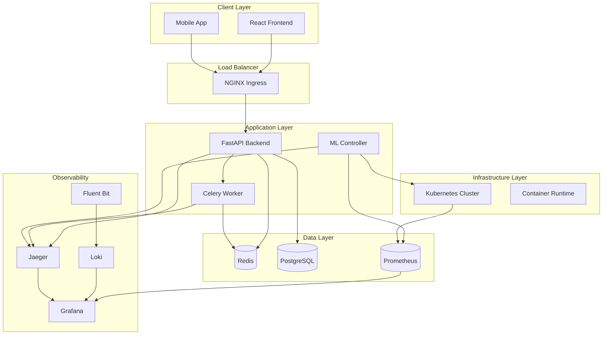

# AutoServe Architecture

## Overview

AutoServe is a comprehensive microservices platform that demonstrates modern cloud-native architecture patterns including:

- **Microservices Architecture**: Loosely coupled services with clear boundaries
- **Event-Driven Communication**: Async messaging with Redis/Celery
- **Auto-scaling**: ML-based intelligent scaling decisions
- **Self-healing**: Kubernetes probes and automatic recovery
- **Observability**: Full-stack monitoring and distributed tracing
- **GitOps**: Declarative deployments with ArgoCD
- **Infrastructure as Code**: Terraform for cloud resources

## System Architecture

## Component Details

### Frontend Service
- **Technology**: React 18, TypeScript, Material-UI
- **Features**: Real-time dashboard, metrics visualization, responsive design
- **Deployment**: Containerized with NGINX, served via Kubernetes Ingress
- **Monitoring**: Browser performance metrics, user experience tracking

### Backend Service
- **Technology**: FastAPI, SQLAlchemy, Pydantic
- **Features**: RESTful API, async operations, JWT authentication
- **Database**: PostgreSQL with connection pooling
- **Cache**: Redis for session storage and task queuing
- **Monitoring**: Prometheus metrics, structured logging, health checks

### Worker Service
- **Technology**: Celery, Redis broker
- **Features**: Async task processing, retry logic, task monitoring
- **Scaling**: Auto-scaling based on queue depth and processing time
- **Monitoring**: Task execution metrics, worker health status

### ML Controller
- **Technology**: Python, scikit-learn, Kubernetes Python client
- **Features**: Predictive auto-scaling, resource optimization
- **Models**: Time series forecasting, anomaly detection
- **Integration**: Prometheus metrics collection, Kubernetes API

## Scaling Strategy

### Horizontal Pod Autoscaler (HPA)
- **Metrics**: CPU, Memory, Custom metrics (queue depth, response time)
- **Thresholds**: Configurable per environment
- **Behavior**: Smooth scaling to prevent thrashing

### ML-Based Scaling
- **Prediction Window**: 5-minute forecasts
- **Features**: Historical metrics, time patterns, external factors
- **Actions**: Proactive scaling before demand spikes
- **Feedback Loop**: Model retraining based on scaling effectiveness

### Vertical Pod Autoscaler (VPA)
- **Resource Optimization**: Automatic resource request/limit tuning
- **Recommendation Mode**: Safe resource recommendations
- **Update Policy**: Recreation or in-place updates

## Security Architecture

### Network Security
- **Network Policies**: Restricted pod-to-pod communication
- **Service Mesh**: Optional Istio for advanced traffic management
- **TLS Termination**: NGINX Ingress with automatic cert management

### Application Security
- **Authentication**: JWT tokens with refresh mechanism
- **Authorization**: Role-based access control (RBAC)
- **Input Validation**: Pydantic schemas for API validation
- **SQL Injection Protection**: SQLAlchemy ORM with parameterized queries

### Container Security
- **Base Images**: Distroless containers for minimal attack surface
- **Security Scanning**: Trivy for vulnerability detection
- **Runtime Security**: Falco for runtime threat detection
- **Secrets Management**: Kubernetes secrets with encryption at rest

## Data Flow

### Request Processing
1. **Client Request** → NGINX Ingress
2. **Load Balancing** → FastAPI Backend
3. **Authentication** → JWT validation
4. **Business Logic** → Database operations
5. **Response** → JSON API response

### Async Task Processing
1. **Task Submission** → Redis queue
2. **Worker Processing** → Celery worker
3. **Progress Updates** → Redis/WebSocket
4. **Completion** → Database update

### Monitoring Data Flow
1. **Metrics Collection** → Prometheus scraping
2. **Log Aggregation** → Fluent Bit → Loki
3. **Trace Collection** → Jaeger
4. **Visualization** → Grafana dashboards

## Deployment Patterns

### Blue-Green Deployment
- **Zero Downtime**: Parallel environment deployment
- **Quick Rollback**: Instant traffic switching
- **Testing**: Production-like environment validation

### Canary Deployment
- **Gradual Rollout**: Progressive traffic shifting
- **Risk Mitigation**: Limited blast radius
- **Automated Rollback**: Metric-based decision making

### Rolling Updates
- **Default Strategy**: Kubernetes rolling updates
- **Health Checks**: Readiness/liveness probes
- **Resource Management**: Pod disruption budgets

## Observability Strategy

### Three Pillars of Observability

#### Metrics (Prometheus + Grafana)
- **System Metrics**: CPU, memory, disk, network
- **Application Metrics**: Request rate, error rate, duration
- **Business Metrics**: User registrations, task completions
- **Custom Metrics**: ML model performance, scaling decisions

#### Logs (Loki + Fluent Bit)
- **Structured Logging**: JSON format with correlation IDs
- **Log Levels**: DEBUG, INFO, WARN, ERROR, FATAL
- **Log Aggregation**: Centralized log storage and search
- **Alert Integration**: Log-based alerting rules

#### Traces (Jaeger)
- **Distributed Tracing**: Request flow across services
- **Performance Analysis**: Bottleneck identification
- **Error Tracking**: Exception propagation
- **Dependency Mapping**: Service interaction visualization

### Alerting Strategy
- **SLI/SLO Monitoring**: Service level indicators and objectives
- **Alert Hierarchy**: Page, ticket, notification levels
- **Escalation Policies**: Time-based escalation rules
- **Runbook Integration**: Automated remediation steps

## Performance Considerations

### Caching Strategy
- **Application Cache**: Redis for frequently accessed data
- **CDN**: Static asset delivery optimization
- **Database Cache**: Query result caching
- **HTTP Cache**: Response caching with appropriate headers

### Database Optimization
- **Connection Pooling**: Efficient database connections
- **Query Optimization**: Index usage and query analysis
- **Read Replicas**: Read traffic distribution
- **Partitioning**: Large table performance optimization

### Resource Management
- **Resource Requests/Limits**: Proper resource allocation
- **Quality of Service**: Guaranteed, burstable, best-effort
- **Node Affinity**: Workload placement optimization
- **Pod Disruption Budgets**: Availability during updates

## Technology Stack Summary

| Component | Technology | Purpose |
|-----------|------------|---------|
| Frontend | React 18, TypeScript, MUI | User interface |
| Backend | FastAPI, SQLAlchemy | API services |
| Worker | Celery, Redis | Async processing |
| ML Controller | Python, scikit-learn | Auto-scaling |
| Database | PostgreSQL | Data persistence |
| Cache/Queue | Redis | Caching and messaging |
| Orchestration | Kubernetes | Container orchestration |
| Monitoring | Prometheus, Grafana | Metrics and dashboards |
| Logging | Loki, Fluent Bit | Log aggregation |
| Tracing | Jaeger | Distributed tracing |
| CI/CD | GitHub Actions, ArgoCD | Automation and deployment |
| IaC | Terraform, Helm | Infrastructure management |
